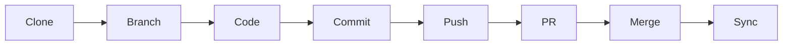
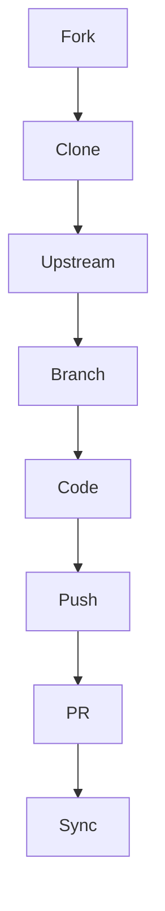

# Workflow

## Basic Git Workflow (Team Collaboration)

### Standard Development Cycle


### Step-by-Step Breakdown

1. **Clone the Repository**  
   ```bash
   git clone https://github.com/team/repo.git && cd repo
   ```
   *Pro Tip: Use SSH for better security*  
   `git clone git@github.com:team/repo.git`

2. **Create Feature Branch**  
   ```bash
   git checkout -b feat/login-form
   ```
   *Branch Naming Convention*:  
   `feat/`, `fix/`, `docs/`, `chore/` prefixes + kebab-case

3. **Make Atomic Changes**  
   - Edit files in small, logical units
   - Test changes locally

4. **Stage & Commit**  
   ```bash
   git add .  # Stage all changes
   git commit -m "feat(login): add email validation"
   ```
   *Commit Message Guide*:  
   - Use [Conventional Commits](https://www.conventionalcommits.org/)  
   - Limit to 72 characters

5. **Push to Remote**  
   ```bash
   git push origin feat/login-form
   ```

6. **Create PR/MR**  
   - Link issues using `Fixes #123` in PR description
   - Request reviews from teammates
   - Pass CI/CD checks

7. **Merge & Cleanup**  
   - Squash commits if needed
   - Delete remote branch post-merge
   ```bash
   git branch -d feat/login-form
   ```

8. **Stay Updated**  
   ```bash
   git checkout main
   git pull --rebase origin main
   ```

## Advanced Workflow (Open-Source Contribution)

### Fork & Contribute Flow


### Step-by-Step Guide

1. **Fork the Repository**  
     
   *GitHub → "Fork" button (top-right)*

2. **Clone Your Fork**  
   ```bash
   git clone git@github.com:your-username/repo.git
   cd repo
   ```

3. **Add Upstream Remote**  
   ```bash
   git remote add upstream https://github.com/original/repo.git
   ```
   Verify with `git remote -v`

4. **Branch Strategically**  
   ```bash
   git checkout -b fix/header-styling
   ```

5. **Develop & Commit**  
   ```bash
   git add -p  # Interactive staging
   git commit -m "fix(ui): correct header padding"
   ```

6. **Push to Your Fork**  
   ```bash
   git push origin fix/header-styling
   ```

7. **Create Upstream PR**  
   - Use GitHub's "Compare across forks"  
   - Include testing evidence in PR comments

8. **Keep Fork Fresh**  
   ```bash
   git fetch upstream
   git rebase upstream/main  # Preferred over merge
   git push --force-with-lease
   ```
   *Never force-push to shared branches!*

## Workflow Comparison

| Aspect               | Basic Workflow              | Advanced Workflow         |
|----------------------|-----------------------------|---------------------------|
| **Repository Access**| Direct clone                | Fork + clone              |
| **Remote Setup**     | Single origin               | Origin + upstream         |
| **Branch Strategy**  | Feature branches            | Topic branches            |
| **Sync Approach**    | Regular pull                | Rebase with upstream      |
| **PR Target**        | Same repository             | Cross-fork                |
| **Maintainer Role**  | Team members                | External maintainers      |

## Best Practices

### Code Quality
- Run linters before committing  
  ```bash
  npm run lint && npm test
  ```
- Keep PRs focused (300-500 lines max)

### Synchronization
```bash
# For basic workflow
git pull --rebase origin main

# For advanced workflow
git fetch upstream
git rebase upstream/main
```

### PR Etiquette
1. Use template with:
   - Description of changes
   - Screenshots/GIFs
   - Testing steps
   - Related issues

2. Respond promptly to reviews

3. Update branch with latest base before final merge

## Common Pitfalls & Solutions

| Issue                        | Solution                    |
|------------------------------|-----------------------------|
| Outdated branch              | `git rebase origin/main`    |
| Broken CI pipeline           | Run tests locally first     |
| Merge conflicts              | Use `git mergetool`         |
| Accidental force-push        | `git reflog` + reset        |
| Forgotten .gitignore entries | `git rm --cached <file>`    |

## Workflow Cheat Sheet

```bash
# Basic
git clone <REPO_URL>
git checkout -b <BRANCH>
git add . && git commit -m "..."
git push origin <BRANCH>

# Advanced
git remote add upstream <UPSTREAM_URL>
git fetch upstream
git rebase upstream/main
git push --force-with-lease
```
