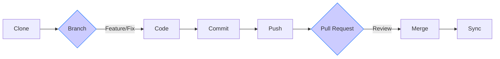
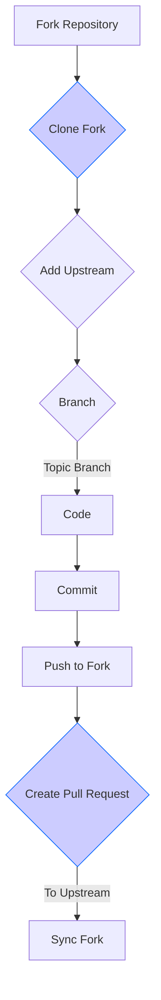

# Git Workflow Guide

This guide outlines effective Git workflows for both team collaboration and open-source contributions. Choosing the right workflow ensures smooth development, minimizes conflicts, and maintains a clean project history.

## Basic Git Workflow (Team Collaboration)

This workflow is ideal for teams working on a shared repository, typically within an organization. It emphasizes feature-based development and code review.

### Standard Development Cycle



### Step-by-Step Breakdown

1.  **Clone the Repository**

    ```bash
    git clone <repository-url> && cd <repository-name>
    ```

    - **Pro Tip:** For enhanced security, use SSH instead of HTTPS.
      ```bash
      git clone git@github.com:<team>/<repo>.git
      ```

2.  **Create a Feature Branch**

    ```bash
    git checkout -b feat/<feature-name>
    ```

    or for bug fixes:

    ```bash
    git checkout -b fix/<issue-name>
    ```

    - **Branch Naming Convention**: Use prefixes to categorize branches:
      - `feat/` for new features
      - `fix/` for bug fixes
      - `docs/` for documentation changes
      - `chore/` for maintenance tasks
      - Use `kebab-case` for branch names (e.g., `feat/user-authentication`)

3.  **Develop and Make Atomic Changes**

    - Focus on implementing a single feature or fix within each branch.
    - Make small, logical, and self-contained commits.
    - Test your changes thoroughly locally before committing. Consider unit tests and integration tests as appropriate.

4.  **Stage and Commit Changes**

    ```bash
    git add . # Stage all changes in the working directory
    git commit -m "<type>(<scope>): <subject>"
    ```

    - **Commit Message Guide**: Follow [Conventional Commits](https://www.conventionalcommits.org/) for clear and structured commit messages.
      - **Type**: `feat`, `fix`, `docs`, `chore`, `refactor`, `test`, `perf` etc.
      - **Scope** (optional): Specify the area of the codebase (e.g., `login`, `api`, `database`).
      - **Subject**: Concise description of the change (limit to 72 characters).
      - Example: `feat(login): add email validation to signup form`

5.  **Push to Remote Repository**

    ```bash
    git push origin <feature-branch-name>
    ```

6.  **Create a Pull Request (PR) or Merge Request (MR)**

    - Initiate a PR/MR from your feature branch to the `main` (or `develop`) branch via your Git platform (GitHub, GitLab, Bitbucket, etc.).
    - **Link Issues**: Reference related issue tracker IDs in the PR description (e.g., `Fixes #123`, `Resolves #456`).
    - **Request Reviews**: Assign relevant team members for code review.
    - **CI/CD Checks**: Ensure all automated checks (tests, linting) pass before merging.

7.  **Merge and Cleanup**

    - **Squash Commits (Optional but Recommended)**: Squashing merges your feature branch commits into a single, clean commit on the `main` branch, simplifying history. This is often preferred for feature branches.
    - **Delete Remote Branch**: After successful merging, delete the feature branch on the remote repository to keep things tidy.
      ```bash
      git branch -d <feature-branch-name> # Delete local branch (already done)
      git push origin --delete <feature-branch-name> # Delete remote branch
      ```

8.  **Stay Updated with the `main` Branch**
    Regularly synchronize your local `main` branch with the remote `main` branch to avoid drift and merge conflicts.
    ```bash
    git checkout main
    git pull --rebase origin main
    ```
    - `--rebase` is preferred to keep a linear and cleaner history, avoiding unnecessary merge commits.

## Advanced Workflow (Open-Source Contribution)

This workflow is commonly used for contributing to open-source projects where you don't have direct write access to the main repository. It involves forking and contributing through pull requests.

### Fork & Contribute Flow



### Step-by-Step Guide

1.  **Fork the Repository**

    - Navigate to the original repository on GitHub (or GitLab, etc.).
    - Click the **"Fork"** button, usually located at the top right. This creates a copy of the repository in your personal account.

    _Illustration of Fork Button on GitHub:_

    ```
    Fork Button: (GitHub → "Fork" button at the top-right of the repository page)
    ```

    _(Unfortunately, I cannot directly display images. Imagine a button labeled "Fork" on the top right of a GitHub repository page.)_

2.  **Clone Your Fork**
    Clone the forked repository to your local machine.

    ```bash
    git clone git@github.com:<your-username>/<repo>.git
    cd <repo>
    ```

3.  **Add Upstream Remote**
    Configure a remote named `upstream` that points to the original repository. This allows you to sync changes from the original repository.

    ```bash
    git remote add upstream [https://github.com/original/](https://www.google.com/search?q=https://github.com/original/)<repo>.git
    ```

    Verify the setup:

    ```bash
    git remote -v
    ```

    You should see both `origin` (your fork) and `upstream` (original repo) listed.

4.  **Create a Topic Branch**
    Create a dedicated branch for your contribution. Similar to feature branches, but often called "topic branches" in open-source context.

    ```bash
    git checkout -b fix/header-styling
    ```

5.  **Develop and Commit Changes**

    ```bash
    git add -p  # Use interactive staging to review changes before staging
    git commit -m "fix(ui): correct header padding on main header"
    ```

6.  **Push to Your Fork**
    Push your topic branch to _your forked repository_ (`origin`).

    ```bash
    git push origin <topic-branch-name>
    ```

7.  **Create an Upstream Pull Request**

    - Navigate to your forked repository on GitHub.
    - Use the "Compare & pull request" button (or similar) to create a new pull request.
    - **"Compare across forks"**: Ensure your pull request is directed from your fork and topic branch to the _original repository's_ `main` (or designated) branch.
    - **Testing Evidence**: In the PR comments, clearly describe the changes and provide evidence of testing (manual testing steps, screenshots, test results, etc.) to help maintainers understand and review your contribution.

8.  **Keep Your Fork Fresh and Synchronized**
    It's crucial to keep your fork's `main` branch synchronized with the original repository's `main` branch to avoid conflicts and ensure you are working with the latest code.
    ```bash
    git fetch upstream
    git rebase upstream/main  # Rebase your local main branch onto upstream/main
    git push --force-with-lease origin main # Update your fork's main branch
    ```
    - `git fetch upstream`: Fetches branches and commits from the `upstream` repository.
    - `git rebase upstream/main`: Replays your local `main` branch commits on top of the fetched `upstream/main`, creating a linear history. **Rebasing is generally preferred over merging** in this workflow for a cleaner history and easier PR integration.
    - `git push --force-with-lease origin main`: Force-pushes your rebased `main` branch to your `origin` (fork). `--force-with-lease` is a safer alternative to `force` as it prevents overwriting remote changes if the remote branch has diverged unexpectedly.
    - **Important:** **Never force-push to shared branches** in team collaboration workflows. Force-pushing is generally safe to _your own fork_.

## Workflow Comparison

| Aspect                       | Basic Workflow (Team)                      | Advanced Workflow (Open-Source)                    |
| ---------------------------- | ------------------------------------------ | -------------------------------------------------- |
| **Repository Access**        | Direct clone (write access)                | Fork + clone (indirect access)                     |
| **Remote Setup**             | Single `origin` remote                     | `origin` (fork) + `upstream` (original) remotes    |
| **Branch Strategy**          | Feature branches                           | Topic branches                                     |
| **Synchronization Approach** | Regular `pull --rebase` from `origin/main` | `rebase upstream/main` to sync fork                |
| **Pull Request Target**      | Same repository (`main` branch)            | Cross-fork (to original repo)                      |
| **Typical Maintainer Role**  | Team members, project owners               | External maintainers, community                    |
| **Complexity**               | Simpler                                    | More complex due to forking and upstream sync      |
| **Use Case**                 | Internal team projects                     | Open-source contributions, external collaborations |

## Best Practices for Both Workflows

These practices enhance code quality, collaboration, and workflow efficiency in both basic and advanced Git workflows.

### Code Quality

- **Linting and Formatting**:
  - Run linters and formatters before committing to maintain consistent code style and catch potential errors early.
    ```bash
    npm run lint # Example for Node.js projects
    npm run format # Example for code formatting
    npm run test  # Run your test suite
    ```
  - Consider integrating linters and formatters into your editor or pre-commit hooks for automatic checks.
- **Keep Pull Requests Small and Focused**:
  - Aim for PRs that are focused on a single feature, fix, or improvement.
  - Smaller PRs are easier to review, understand, and merge, reducing review time and potential for errors.
  - Ideally, keep PRs under 300-500 lines of code changes as a general guideline.

### Branch Synchronization

- **Regularly Sync with the Base Branch**: Stay up-to-date with the `main` (or `develop`) branch to minimize merge conflicts and ensure you are building on the latest changes.

  ```bash
  # For basic workflow
  git pull --rebase origin main

  # For advanced workflow
  git fetch upstream
  git rebase upstream/main
  ```

### Pull Request (PR) Etiquette

1.  **Use a PR Template**:
    - Utilize a well-defined PR template (provided by your team or project) to ensure all necessary information is included. A good template typically includes sections for:
      - **Description of Changes**: Clearly explain what the PR does and why.
      - **Screenshots/GIFs (if applicable)**: Visual evidence for UI changes or bug fixes.
      - **Testing Steps**: Detail how reviewers can manually test the changes.
      - **Related Issues**: Link to relevant issue tracker tickets.
2.  **Respond Promptly to Reviews**:
    - Actively engage with reviewers, address their comments and questions promptly, and iterate on your code based on feedback.
3.  **Update Branch Before Final Merge**:
    - Before merging, always re-sync your branch with the latest base branch (`main` or `upstream/main`) to resolve any potential last-minute conflicts.
4.  **Keep PRs Drafts for Work in Progress**:
    - Use "Draft" PRs to share work in progress and get early feedback, signaling that the PR is not yet ready for final review and merge.

## Common Pitfalls & Solutions

| Issue                              | Solution                                                                                                                           |
| ---------------------------------- | ---------------------------------------------------------------------------------------------------------------------------------- |
| **Outdated Branch**                | `git rebase origin/main` (or `upstream/main`) to sync with the base branch.                                                        |
| **Broken CI Pipeline**             | Run tests and linters locally _before_ pushing to catch issues early.                                                              |
| **Merge Conflicts**                | Use `git mergetool` for a graphical merge conflict resolution, or manually edit conflicted files.                                  |
| **Accidental Force-Push**          | Use `git reflog` to find the lost commit and `git reset --hard <commit-hash>` to recover. **Avoid force-pushing shared branches.** |
| **Forgotten `.gitignore` Entries** | `git rm --cached <file>` to remove tracked files, then add to `.gitignore` and commit.                                             |
| **Large Commits**                  | Break down large changes into smaller, logical commits. Use `git add -p` for interactive staging.                                  |
| **Commiting Directly to `main`**   | Always work in feature/topic branches and use Pull Requests to merge into `main`.                                                  |

## Workflow Cheat Sheet

Quick reference commands for common Git operations in both workflows.

```bash
# --- Basic Workflow (Team Collaboration) ---
# Initial Setup
git clone <REPO_URL>             # Clone repository
cd <REPO_NAME>                  # Change directory

# Feature Development
git checkout -b feat/<BRANCH_NAME> # Create and switch to feature branch
# ... code changes ...
git add .                       # Stage all changes
git commit -m "feat(<scope>): <subject>" # Commit changes
git push origin feat/<BRANCH_NAME> # Push to remote

# Staying Updated
git checkout main
git pull --rebase origin main   # Sync with remote main

# --- Advanced Workflow (Open-Source Contribution) ---
# Initial Setup
git fork <original_repo>        # Fork on GitHub (web UI)
git clone git@github.com:<your-username>/<repo>.git # Clone your fork
cd <REPO_NAME>
git remote add upstream <UPSTREAM_URL> # Add upstream remote

# Topic Branch Development
git checkout -b fix/<BRANCH_NAME> # Create and switch topic branch
# ... code changes ...
git add -p                      # Interactive staging
git commit -m "fix(<scope>): <subject>" # Commit
git push origin fix/<BRANCH_NAME> # Push to your fork

# Syncing Fork with Upstream
git fetch upstream
git rebase upstream/main       # Rebase main onto upstream
git push --force-with-lease origin main # Update your fork's main
```

##### Copyright (c) 2026 squared-studio
